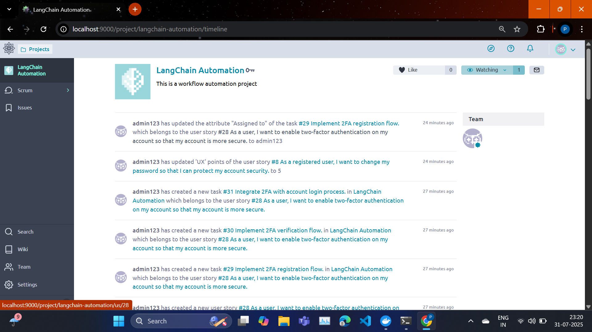

# 🐯 Taiga Agile Automation with Gemini API

Automatically generate user stories, subtasks, and priority-tag metadata for your Taiga project using Google Gemini LLM — all from plain feature ideas. Built for the self-hosted Docker-based Taiga system.

---

## 📌 Features

* ✅ Generate Agile-style user stories from plain feature ideas
* ✅ Generate subtasks for each user story
* ✅ Predict tags (e.g., `auth`, `backend`) and priority (`High`, `Medium`, `Low`)
* ✅ Insert stories and tasks directly into your self-hosted Taiga via API
* ✅ Modular and extensible Python codebase

---

## 🛠️ Tech Stack

| Tool               | Purpose                                                  |
| ------------------ | -------------------------------------------------------- |
| **Taiga (Docker)** | Agile project management platform                        |
| **Docker Compose** | Container orchestration to run Taiga locally             |
| **Python**         | Automation logic and API calls                           |
| **Gemini API**     | LLM used to convert features into user stories and tasks |
| **dotenv**         | Environment variable management                          |
| **requests**       | REST API client for Python                               |
| **WSL/Linux Environment**       | Operating System                               |

---

## 🚀 Getting Started

### 1. Clone the Repository

```bash
git clone https://github.com/your-username/taiga-task-automation.git
cd taiga-task-automation
```

### 2. Set Up Taiga Locally with Docker

Make sure Docker is installed and it should support WSL/Linux.

Create a `docker-compose.yml` file (or use the one from Taiga GitHub):

```yaml
version: '3.7'
services:
  taiga:
    image: taigaio/taiga-back:latest
    ports:
      - "9000:80"
    environment:
      - TAIGA_SECRET_KEY=randomkey
```

Run Taiga using Docker:

```bash
docker compose up -d
```

Then access Taiga at: [http://localhost:9000](http://localhost:9000)

---

### 3. Setup Python Environment

```bash
python3 -m venv env
source env/bin/activate
pip install -r requirements.txt
```

> You’ll need `google-generativeai`, `requests`, and `python-dotenv`

---

### 4. Configure `.env` File

Create a `.env` file:

```env
TAIGA_BASE_URL=http://localhost:9000
TAIGA_USERNAME=your-username
TAIGA_PASSWORD=your-password
GEMINI_API_KEY=your-gemini-api-key
PROJECT_SLUG=your-project-slug
```

---

## 🧠 How It Works

```text
Feature Idea → Gemini API → User Stories + Subtasks + Tags → Taiga Tasks via API
```

### Sample Flow

1. You input: "Implement user profile editing and password reset features"
2. Gemini generates 3 user stories
3. Each story gets 3 subtasks
4. Tags and priority are predicted
5. All inserted into Taiga project with linkage

---

## 📂 Directory Structure

```
taiga_task_automation/
├── main.py
├── .env
├── auth/
│   └── taiga_auth.py
├── api/
│   └── create_tasks.py
├── generators/
│   ├── task_generator.py
│   ├── subtask_generator.py
│   └── tag_predictor.py
```

---

## 📸 Output Example



> The above screenshot shows generated user stories and their linked subtasks in Taiga UI.

---

## 🏁 Running the Pipeline

```bash
python main.py
```

You’ll see stories and tasks live-updated in Taiga.

---

## 🔧 Optional Enhancements

* Add retry logic for Gemini API
* Batch all LLM prompts per feature to reduce quota usage
* Log all generated content to `automation_log.json`
* Schedule story creation (e.g., once a day)

---

## 📄 License

MIT License.

---

## 🙋‍♂️ Need Help?

Open an issue or contact the project maintainer.

---
